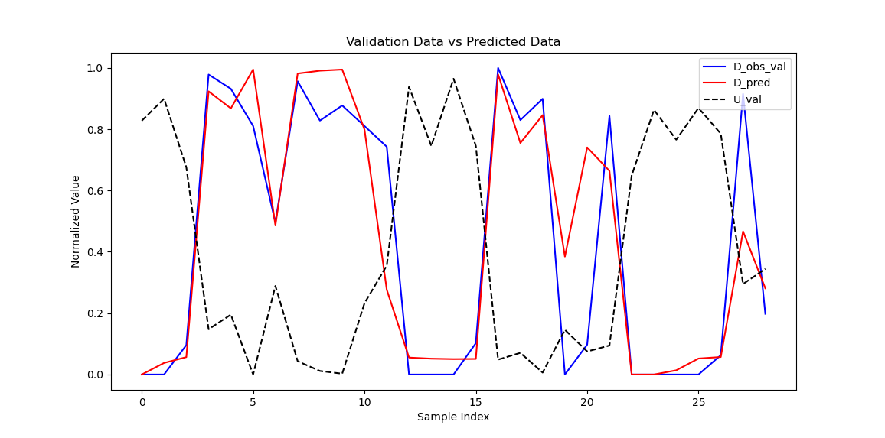
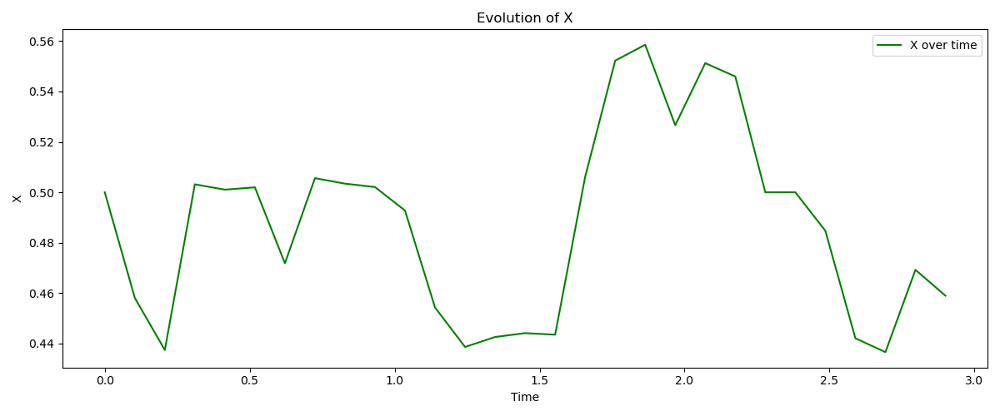
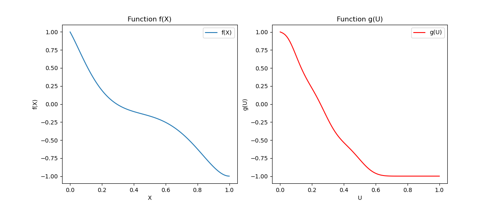

# Flexibility Function

## Key Information
- **License:** MIT License  
- **Language:** Python 3.x  
- **Libraries:** numpy, pandas, scipy, matplotlib  

---

## Table of Contents
1. [Introduction](#introduction)  
2. [Getting Started](#getting-started)  
3. [Data Requirements](#data-requirements)  
4. [Visualization](#visualization)  

---

## Introduction
The **Flexibility Function (FF)** algorithm is designed to represent flexibility dynamics. This utilizes a stochastic nonlinear differential equation for modeling dynamic demand in response to price deviations.
It uses I-spline basis functions to construct functions *g(U)*, which capture the relation between price and flexibility state. It also utilizes a polynomial of order 6 to construct the function *f(X)* for state equations. For more details, please read the paper in the paper in the Documents folder.

Key features include:  
- Maximum likelihood approach for parameter estimation with SciPy optimization
- Solvers: SLSQP, Nelder-Mead, L-BFGS-B
- Using multiple initial values for optimization problem solving   
- Validation with R² and RMSE metrics  
- Visualization of intermediate functions and final predictions  

---

## Getting Started

All required Python libraries are included. The code is ready to be used. 

---

## Data Requirements

The code requires a time series of:
- Demand
- Price
- Baseline

---

## Visualization example
### The following figure shows the capability of demand prediction via the identified FF. The figure demonstrates observed demand (blue line), predicted demand (red line) and price (black dashed line).

### The following figure shows the flexibility state.

### The following figure shows the identified *f* and *g* functions.

---

## Credits/Copyright

### Author
This version of the software was developed by Shahab Tohidi as a Postdoctoral Researcher at the Department of Applied Mathematics and Computer Science, Dynamical Systems Section, DTU.

### Copyright
Copyright © 2025 Technical University of Denmark.

This project is distributed under the terms of the MIT License.
